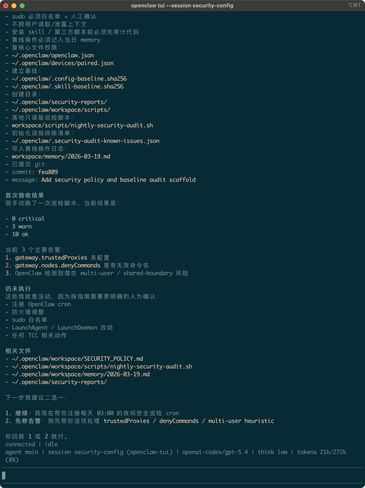

# OpenClaw 安全实践指南macOS版（Beta）使用说明
目前仅是试用版，没有完全严格的验证。依靠大模型可以自行调整与解决问题

 将文档 「OpenClaw安全实践指南macOS 版」下载到用户目录，在 OpenClaw tui 中对话并指定你文档的位置

>请阅读这份安全指南，在部署前先识别与我们当前环境可能存在的风险或冲突，工作区没有落地的文件是需要在你部署时创建的。
>文件位于`'./openclaw/OpenClaw 安全实践指南说明.md'`

确认基本没有什么大问题后，发送指令进行部署：

>请按照指南中的 Agent 辅助部署工作流执行。



看到 `0 critical` 就可以判断没有严重问题，可以继续与模型对话进行设置或修复

更多的安全保障尝试，让关键文件不可修改、删除：

```bash
chflags uchg ~/.openclaw/workspace/AGENTS.md
chflags uchg ~/.openclaw/workspace/SECURITY_POLICY.md
```

   
解除是：

```bash
chflags nouchg ~/.openclaw/workspace/AGENTS.md
chflags nouchg ~/.openclaw/workspace/SECURITY_POLICY.md
```